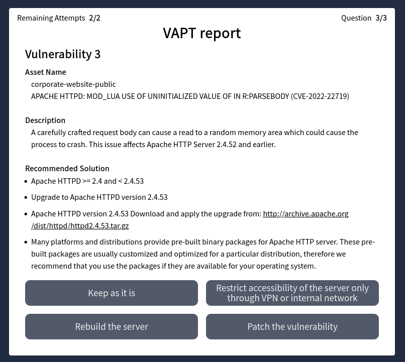
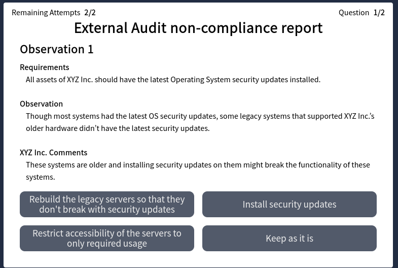

# Security Engineer Intro

<figure><figcaption>
Security Engineer Intro thumbnail
</figcaption></figure>

**Task 2 What is a Security Engineer?**

* Who ensures that an organization's cyber security risk is minimized at all times?

Security engineer

**Task 3 Core Responsibilities of a Security Engineer**

* Where are details about an organization's digital assets, such as name, IP address, and owner, stored?

Asset inventory

* Sometimes security policies can't be followed because of business needs. What avenue does a security engineer have to fulfil business needs in these cases?

Exceptions

* What philosophy, if followed, provides the most Return on Investment (ROI)?

Secure by design

**Task 4 Continuous Improvement**

* What is considered the weakest link in an organization's security?

humans

* An organization's security evolves with the organization. What helps a security engineer keep the organization secure through these changes?

Change management

**Task 5 Additional Roles and Responsibilities**

* What is a theoretical exercise carried out to gauge the operational readiness of an organization from a security point of view?

Tabletop Exercises

* What is the priority of the management in case of a disaster or crisis?

business continuity

**Task 6 Walking in Their Shoes**

* VAPT report #1&#x20;

<figure><figcaption>
VAPT report 1
</figcaption></figure>

Restrict accessibility of the server only through VPN or internal network

<figure><figcaption>
VAPT report 2
</figcaption></figure>

Restrict accessibility of the server only through VPN or internal network

<figure><figcaption>
VAPT report#3
</figcaption></figure>

Patch the vulnerability

<figure><figcaption>
VAPT report 4
</figcaption></figure>

Restrict accessibility of the servers to only required usage&#x20;

<figure><figcaption>
VAPT report 5
</figcaption></figure>

Aggregate cloud logs in a single place.

Forward the logs from the palce to on-prem network using a restricted tunnel.

* What is the flag shown on the completion of the static site?

Click me

THM{S3CUR1TY\_3NG1N33R5\_R0CK}

