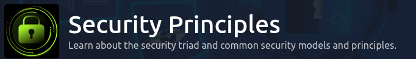
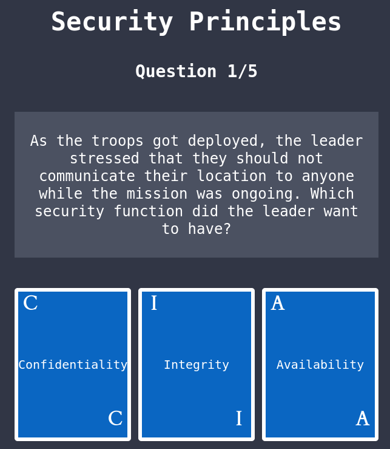
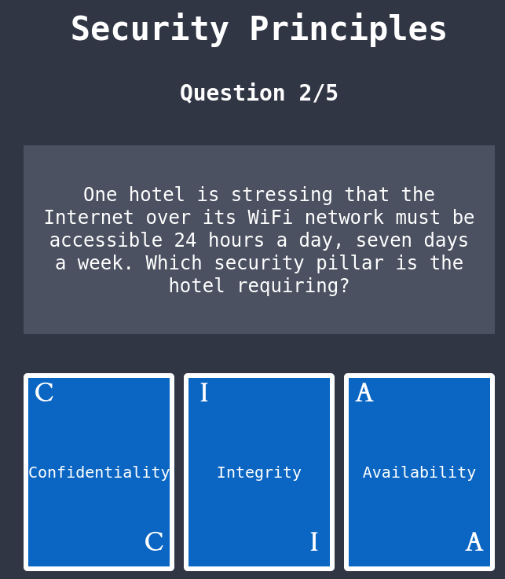
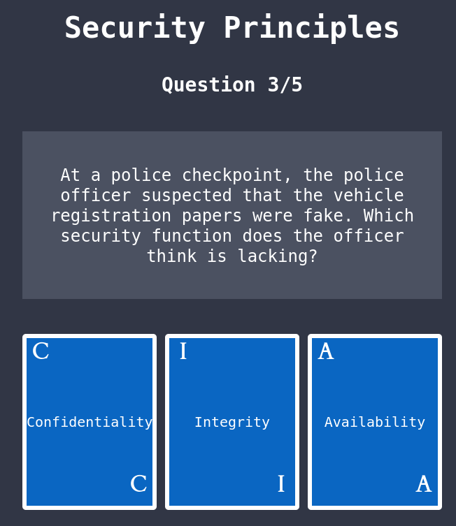
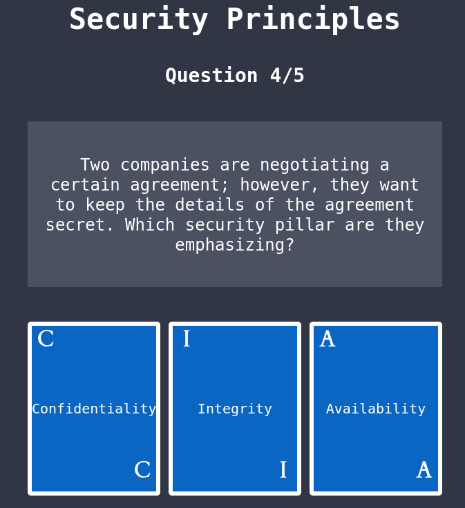
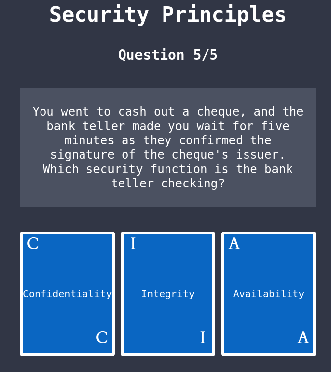

# Security Principles

<figure><figcaption></figcaption></figure>

**Task 2 CIA**

* Q1

<figure><figcaption></figcaption></figure>

Confidentiality

* Q2

<figure><figcaption></figcaption></figure>

Availability

* Q3

<figure><figcaption></figcaption></figure>

Integrity

* Q4

<figure><figcaption></figcaption></figure>

Confidentiality

* Q5

<figure><figcaption></figcaption></figure>

Integrity

* What is the flag that you obtained at the end?

Click me

THM{CIA\_TRIAD}

\--- To be continued
